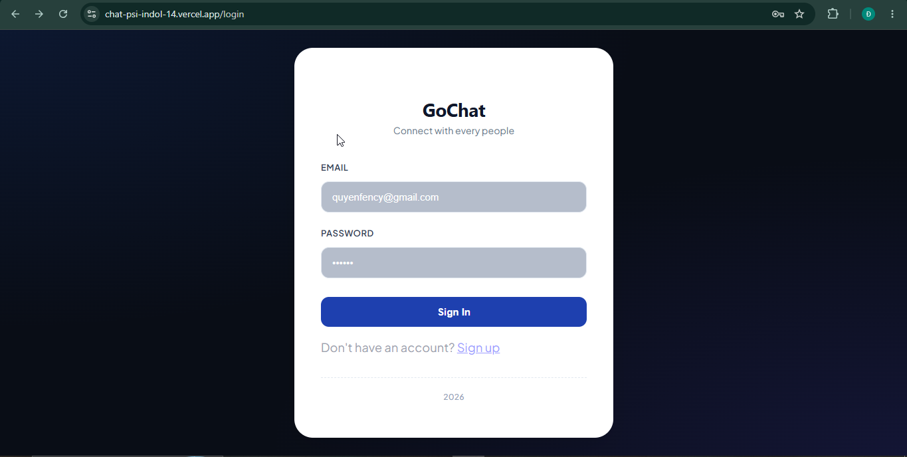
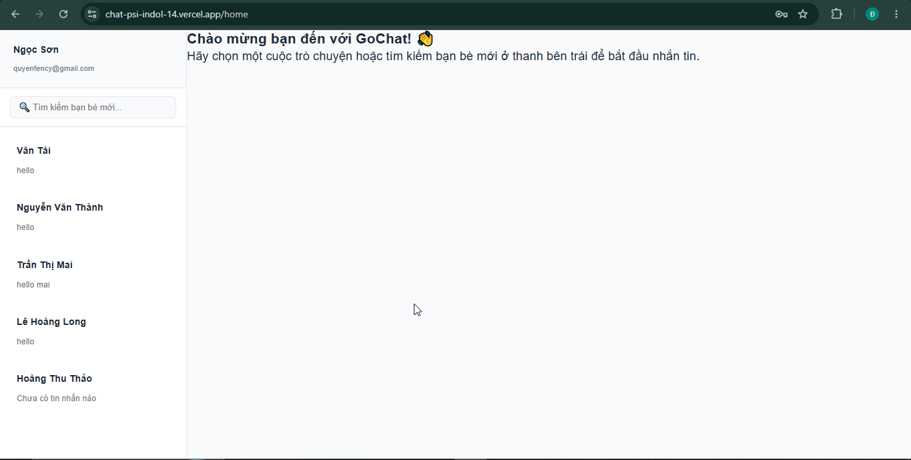
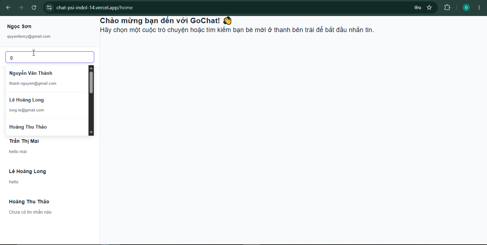
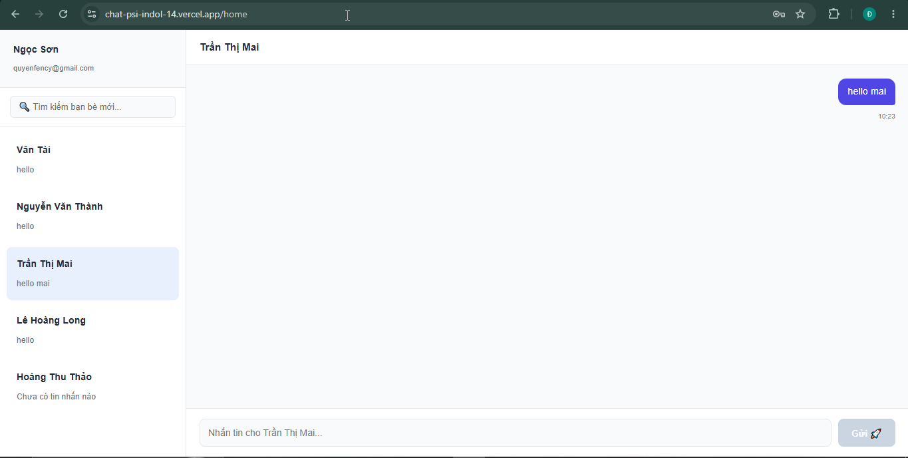

# GoChat - Real-time Chatting Application
## Demo link : https://chat-psi-indol-14.vercel.app/
## Brief Description

GoChat is a full-stack web application designed for instant messaging and real-time collaboration. The application combines REST APIs with WebSocket communication to provide secure authentication, persistent conversations, and real-time message delivery.

---

# Tech Stack

| Layer                   | Technology                 |
| ----------------------- | -------------------------- |
| Backend                 | Spring Boot (Java)         |
| Frontend                | ReactJS                    |
| HTTP Client             | Axios                      |
| Real-time Communication | WebSocket (STOMP + SockJS) |
| Database                | MySQL                      |
| Authentication          | JWT + HttpOnly Cookie      |

---

# System Architecture

GoChat uses two communication models:

### REST API

REST APIs are responsible for operations that require request-response communication, including:

* User authentication
* Account registration
* Email OTP verification
* User profile retrieval
* Conversation management
* Loading chat history

### WebSocket

WebSocket provides a persistent connection between the client and server for real-time communication. It is responsible for:

* Sending messages instantly
* Receiving new messages without refreshing the page
* Broadcasting messages to participants in a conversation
* Updating unread message indicators in real time

---

# Core Features

## Login & Authentication

<details>
<summary>📸 View Login Page</summary>



</details>

---

## Main Chat Dashboard

<details>
<summary>📸 View Dashboard</summary>



</details>

---

## User Discovery & Contact Search

<details>
<summary>📸 View Search Interface</summary>



</details>

---

## Active Chat Window

<details>
<summary>📸 View Chat Room</summary>



</details>

---

## Message Status & Notifications

<details>
<summary>📸 View Message Status</summary>


</details>

---

# API Specification

## Authentication APIs

### `POST /register`

Registers a new user account.

**Request Body**

```json
{
  "fullname": "John Doe",
  "email": "john@example.com",
  "password": "123456"
}
```

**Response**

* Creates a new inactive account.
* Generates and sends a six-digit OTP to the user's email.

---

### `POST /verify-otp`

Activates a registered account using the OTP sent via email.

**Request Body**

```json
{
  "email": "john@example.com",
  "otp": "123456"
}
```

**Response**

* Activates the user account.
* Returns a success message if the OTP is valid.

---

### `POST /login`

Authenticates the user.

**Request Body**

```json
{
  "email": "john@example.com",
  "password": "123456"
}
```

**Response**

* Verifies user credentials.
* Generates a JWT.
* Stores the JWT inside an HttpOnly cookie.
* Returns the authenticated user's information.

---

## User APIs

### `GET /user-profile`

Returns information about the currently authenticated user.

Authentication is required.

Example response:

```json
{
  "id": 1,
  "fullname": "John Doe",
  "email": "john@example.com"
}
```

---

## Conversation APIs

### `GET /my-conversations`

Returns all conversations that belong to the authenticated user.

Each conversation contains:

* Conversation ID
* Participant information
* Last message preview
* Last message timestamp

---

### `POST /start-conversation`

Creates a private conversation if one does not already exist.

**Request Body**

```json
{
  "targetUserId": 5
}
```

If a conversation between the two users already exists, the existing conversation ID is returned instead of creating a new one.

---

## Message APIs

### `GET /chat-history`

Retrieves the complete message history of a conversation.

Example:

```
GET /chat-history?conversationId=12
```

Returns messages ordered by creation time.

Each message includes:

* Sender ID
* Sender name
* Message content
* Creation timestamp
